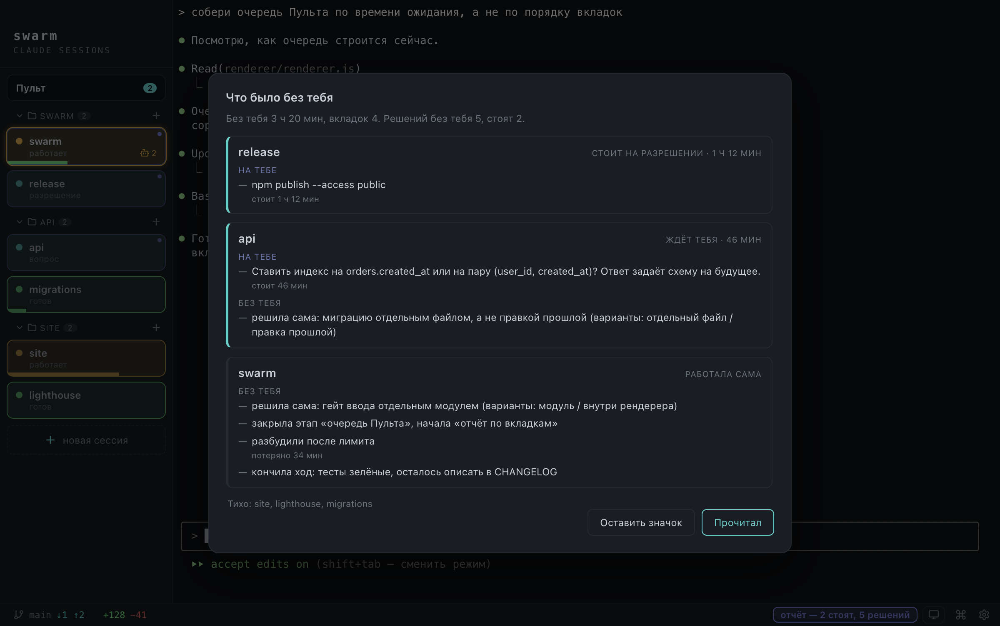

# Swarm — руководство

Пульт для нескольких сессий Claude Code сразу. Каждая вкладка — настоящий процесс `claude`,
запущенный в вашем login-шелле: ваши алиасы, ваши слэш-команды, ваша подписка. Своей
авторизации у Swarm нет, токены Клода он не читает и не хранит.

Это подробное руководство. Короткая версия со скриншотами — в [README](README.md), здесь то
же самое, но с деталями и оговорками, до которых там не доходит дело. Порядок — по рабочему
дню: поставили, завели агента, поняли, что с ним происходит, ответили тому, кто ждёт, ушли
и вернулись за отчётом.

Нужны macOS на Apple Silicon или Windows.

**Оглавление.** [Перед первым запуском](#перед-первым-запуском) ·
[Установка](#установка) · [Первый агент](#первый-агент) ·
[Пока агент работает](#пока-агент-работает) · [Когда ждут несколько](#когда-ждут-несколько) ·
[Что под рукой](#что-под-рукой-пока-вы-правите-код) · [Ночной режим](#ночной-режим-работа-без-вас) ·
[Телеграм](#телеграм-отвечать-агентам-с-телефона) ·
[Расход подписки](#расход-подписки-его-видит-и-агент) ·
[Перезапуск](#перезапуск-с-чистой-сессией) · [Настройки](#настройки-где-что-лежит) ·
[Клавиши](#горячие-клавиши) · [Другие агенты](#другие-агенты-кроме-клода) ·
[Если что-то не так](#если-что-то-не-так)

---

## Перед первым запуском

**Claude Code установлен и залогинен.** Проверьте в терминале:

```bash
claude --version
```

Если команды нет — сначала поставьте и авторизуйте Claude Code. Swarm запускает ровно этот
`claude`, так что без него работать не будет.

Аккаунт и модель живут в вашем шелле, а не в приложении. Нужен конкретный аккаунт или свой
`ANTHROPIC_BASE_URL` — пропишите `export` в `~/.zshrc`, и каждая новая вкладка его подхватит.

---

## Установка

**Одной командой.** Приложение окажется в «Программах» и откроется сразу, без блокировки:

```bash
npx claude-swarm
```

Нужна Node 18 и старше; внутри пакета короткий `scripts/install.sh`, его видно целиком.

**Образом.** `.dmg` для macOS и `.exe` для Windows лежат в
[релизах](https://github.com/raul-cortez/claude-swarm/releases) — ссылки на последнюю версию
стоят в шапке README. Про Windows отдельно написано в [WINDOWS.md](WINDOWS.md).

Если качали браузером, первый запуск на macOS упрётся в «не удалось проверить разработчика»:
карантин вешает браузер, которым качали, установщик выше его не вешает. Откройте `.dmg`,
перетащите **Swarm** в **Applications** и снимите карантин — это делается один раз:

```bash
xattr -dr com.apple.quarantine /Applications/Swarm.app
```

Без терминала: попробуйте открыть Swarm, получите отказ, потом в **Системные настройки →
Приватность и безопасность** нажмите **Open Anyway** — раньше неудачной попытки этой кнопки
там нет. Правый клик → Open, который работал на старых macOS, в 15 и новее отключён.

> При первом запуске в новой папке macOS может спросить доступ к файлам — разрешайте, это
> нужно `claude`, чтобы читать проект. Спросят один раз: обновления приложения этот ответ
> больше не сбрасывают.

Новые версии Swarm находит сам и ставит по кнопке в настройках. Переустанавливать не нужно.

**Из исходников** — если правите сам Swarm:

```bash
npm install     # ставит зависимости и пересобирает node-pty под ABI Электрона
npm start       # запускает приложение
npm run dist    # свой .dmg, результат в dist/
```

Подробности сборки и устройство кода — в [DEVELOPMENT.md](DEVELOPMENT.md).

---

## Первый агент

Кнопка **＋ новая сессия** спрашивает папку и запускает агента в ней — так `claude` видит код
проекта. Клавиатурой то же самое: **⌘O** — с выбором папки, **⌘T** — в папке по умолчанию
(`~/ClaudeSwarm`). Вкладка сама запускает `claude` и подхватывает вашу авторизацию.

Заводите агентов в папках проектов, а не в домашней: иначе macOS засыплет вас запросами
доступа к файлам — по одному на каждую папку, куда агент заглянет.

Вкладки группируются по папкам, поэтому агенты разных проектов не путаются между собой.
Дальше:

- **клик** по карточке — открыть её терминал, **⌘1 … ⌘9** — то же по номеру;
- **двойной клик** по названию — переименовать (можно в несколько строк);
- **перетаскивание** за левый край — переставить карточку или перенести её в другую группу;
- **крестик** или **⌘W** — закрыть вкладку вместе с процессом `claude`. С подтверждением,
  чтобы не убить работу случайно.

---

## Пока агент работает

Смотреть в терминал, чтобы понять, что с агентом, не нужно: вкладка красится сама.

| Цвет вкладки | Что происходит |
|---|---|
| **Оранжевая** | работает: печатает, думает, гоняет инструмент |
| **Бирюзовая** | ждёт вашего ответа — вопрос или запрос разрешения |
| **Зелёная** | закончил, ждёт нового задания |
| **Серая** | вкладка закрыта, процесс вышел |

Рядом с цветом карточка показывает, сколько агент уже ждёт, сколько у него работает
подагентов и насколько заполнен контекст. Полоска контекста отвечает на вопрос «кого пора
сжимать»; полную картину по всем вкладкам даёт `/usage` в Телеграме.

### Откуда берётся цвет

Цвет не угадывается по картинке в терминале — его сообщает сам Клод. Источников три, в
порядке старшинства:

1. **Хуки Клода** — единственный канал, который видит диалоги: «просит разрешение», «задал
   структурный вопрос». Настройки у них нет, они всегда включены: хуки прописываются только в
   собственный файл настроек, который вкладка получает флагом, а ваш `~/.claude/settings.json`
   Swarm не трогает никогда.
2. **Стенограмма** — Клод пишет каждое сообщение в свой журнал по ходу дела, и приложение его
   читает. Отсюда «работает / думает / конец хода» без угадывания, и отсюда же берётся текст
   вопроса — дословно и целиком, даже если на экране он уже уехал вверх. Вкладка привязана к
   своему журналу точно, файлы не путаются.
3. **Экран** — подстраховка: диалог разрешения виден только там, и там же работает старая
   логика для вкладок, где Клод запущен не приложением.

### Вопрос, работа и фон: метка

Один случай не виден ни одному каналу сам по себе: Клод заканчивает ход одинаково и когда
работа сделана, и когда он задал вопрос текстом. Отличить их можно только по тому, что агент
написал, — поэтому он ставит **метку**. Выглядит она так:

    [swarm:вопрос]

    Собрал стенд, прогнал оба варианта. Что ставим — заливку или точку?

Строка с меткой стоит в начале сообщения, и вкладка от неё становится «ждёт ответа».
По-английски то же самое: `[swarm:question]`.

Так же решается третий случай — **запущена фоновая задача**. Агент отправил долгий замер или
сборку, ход закрыл, а вернётся к вам сам, когда та досчитает: отвечать нечего, но и работу
такой вкладке давать рано. Зелёной она была бы неправдой, поэтому агент начинает сообщение
строкой `[swarm:фон]` — и вкладка остаётся оранжевой, «работает в фоне». В телеграм
такой ход уезжает с часиками ⏳ вместо галочки, чтобы с телефона было видно: это ещё не конец,
отвечать не нужно. Не поставил ничего — значит готов.

Метка считается только с начала строки. Внутри фразы она не значит ничего, так что агент
может спокойно писать о ней в отчёте или в доке и себя этим не позовёт.

Просить об этом агента самому не нужно, и настройки для этого нет: правило Swarm подставляет
сам, флагом `--append-system-prompt` в команду каждой новой вкладки — спрашивать через выбор
вариантов, а вопрос в тексте помечать этой строкой. Ваши файлы при этом не меняются: правило
живёт только в командах, которые собирает приложение.

Отступает оно в двух случаях: вы сами передали агенту `--append-system-prompt` (ваш текст
главнее — перебивать его молча хуже, чем потерять подсказку про статус) или вкладка запускает
не Клода, а лончер, в имени которого его не видно. Тогда объясните тег агенту сами — одной
строкой в `CLAUDE.md` проекта или в своём `~/.claude/CLAUDE.md`.

Одну старую подпись приложение понимает по-прежнему — «Сейчас от тебя», — если она осталась у вас в `CLAUDE.md`: она ищется
в любом месте сообщения, «Сейчас от тебя: ничего, жди…» вопросом не считается, а «ничего,
**жду** замер стенда» читается как фоновая работа. Разница в лице глагола: **жду** — ждёт
агент, работа идёт; **жди** — ждёте вы, значит он закончил.

### Уведомления

Когда вкладка в фоне стала бирюзовой или зелёной, прилетает системное уведомление. Клик по
нему выводит приложение на передний план к нужной вкладке — можно запускать несколько агентов
и не сидеть, уставившись в экран. В настройках можно оставить только одно из двух событий,
добавить звук или выключить уведомления совсем.

---

## Когда ждут несколько

Вкладка **Пульт** (**⌘0**) держит очередь всех, кто ждёт ответа, с таймером у каждого.
Отвечать можно прямо оттуда, в терминал выбранного, и после ответа очередь сама переходит к
следующему.

Счётчик ожидающих стоит на самой вкладке Пульта, так что заходить внутрь, чтобы узнать, нужны
ли вы кому-то, не приходится: ждать некому — счётчика нет. Если Пульт вам не нужен вовсе, его
вкладку убирает галочка «Показывать пульт» в «Настройки → Вид».

---

## Что под рукой, пока вы правите код

**Раскладка.** **⌘L** переключает вид: список вкладок рейлом слева или плашками-дашбордом
сверху. Выбор запоминается; там же, в «Настройки → Вкладки», он выбирается мышью.

**Команды проекта.** Кнопка **☰ команды** (**⌘K**) открывает список: встроенные команды по
группам плюс автоматически найденные слэш-команды и скиллы **этого проекта**
(`.claude/commands`, `.claude/skills`) и ваши глобальные (`~/.claude/…`). Выбрать из списка
быстрее, чем вспоминать точное имя. Команды с «…» ждут, что вы допишете аргумент.

**Ветка и правки.** Внизу окна показана ветка папки активной вкладки и что с ней происходит:
`+N −M` — сколько строк добавлено и удалено, но не закоммичено, `↓N` — на сервере N новых
коммитов, `↑N` — у вас N неотправленных.

Клик по счётчику изменений показывает дифф — деревом файлов и подсветкой правок, с выходом в
ваш редактор. Клик по имени ветки открывает меню: свериться с сервером, подтянуть новое и
список веток по свежести, клик переключает. Смотреть и переключать ветки можно всегда; чтобы
сходить на сервер, нужно быть залогиненным в git, и если нет, приложение объяснит, как войти.

---

## Ночной режим: работа без вас

Вы отдаёте вкладке задачу и уходите — за кофе, спать, в другую вкладку. Проблема одна: агент
останавливается на первом же вопросе и стоит, пока вы не вернётесь, даже если спрашивал про имя
переменной. Восемь вкладок — восемь потерянных вечеров.

Лечится это **ночным режимом**: работай без меня. Включается он двумя дверями, и они про разное.

**Одной вкладке.** Наведите на её карточку и нажмите **полумесяц** — он появляется по
наведению у подписи статуса и остаётся горящим, пока вкладка ночная. Карточка целиком
становится фиолетовой, так что видно, какие вкладки уже не ваши; палитра статусов на ней не
работает — цвет отвечает на вопрос «чья она», а что с агентом, остаётся подписью словами.
То же самое делает `/night`, отправленная в тему этой вкладки, и пункт «Ночной режим» в меню
карточки по правому клику. Так и живёт обычный день: одной вкладке отдали задачу на вечер, в
остальных сидите сами.

**Всем сразу.** В нижней панели, рядом с шестерёнкой, значок «где я». Нажмите и выберите
**«ночной режим»**. Вся нижняя панель станет синей — это видно от двери, и нужно это, когда вы
вернулись: приложение всё ещё считает, что вас нет. Бот в телеграме для этого не нужен, уйти
можно и без телефона; с телефона то же положение включает и снимает `/night`, отправленная в
**общую** тему группы.

Общее положение **не переписывает** отметки вкладок: пока оно включено, в ночном режиме все, а
когда вы вернулись — каждая вкладка возвращается к своему выбору. Те, которым вы отдали задачу,
продолжают. Сколько их прямо сейчас, показывает счётчик в нижней панели, и клик по нему забирает
все назад одним движением.

<p align="center"></p>

### Что происходит с отданной вкладкой

Агент, который собирается спросить вас с вариантами
«1/2/3», получает отказ и вместе с ним правило: человека нет; если решение обратимо или
переделка дешёвая — выбери сам и продолжай, а если ответ задаёт направление и ошибка стоит
дорого — сформулируй вопрос текстом и остановись. Отказ приходит **внутри хода**, поэтому агент
не встаёт вовсе: прочитал и пошёл дальше.

Если вопрос всё-таки задан текстом и вкладка встала, сворм один раз печатает в неё то же
правило. Один — и это важно: агент, услышавший правило, помнит его до конца работы. Встал с
вопросом уже после правила — значит вопрос настоящий, и вкладка спокойно ждёт вас, а сворм с ней
больше не спорит.

### В отданную вкладку не печатают

Первая клавиша агенту не уедет: сворм спросит, забрать
ли вкладку себе, и набранное уйдёт только после «Забрать себе». Это не строгость ради
строгости: в такую вкладку печатает сам сворм — толчок правилом, вопрос про фазу, будильник по
лимиту, — а два писателя в одну строку ввода дают мусор вместо просьбы. И чаще всего человек,
печатающий в отданную вкладку, просто забыл, что отдал её. Кнопка «Забрать себе» снимает
отметку с этой вкладки (а если включён общий ночной режим — и его), остальные вкладки продолжают
сами.

**Свои слова.** Оба текста можно переписать — «Настройки → Ночной режим»: правило (то, что агент
получает вместо запрещённой рамки, и тем же текстом сворм толкает вставшую вкладку) и вопрос
замолчавшей вкладке. В полях уже лежат заготовки сворма — правьте их как обычный текст, а
кнопка под полем вернёт заготовку назад. Переписывают их под свой уклад: кому-то нельзя касаться
миграций, кому-то можно всё, кроме сети. Одно место не свободно — метка вопроса: напишите в своём
тексте `{тег}`, и сворм подставит её сам. Сама метка (`[swarm:вопрос]`) зашита и не
настраивается — по ней сворм и понимает, что вкладка ждёт вас.

**Чего ночной режим не даёт.** Сворм не отвечает за вас на запросы разрешения: там нужно выбрать
вариант в диалоге, а одобрять чужие команды молча — не то, за что стоит платить спокойным сном.
Такая вкладка стоит до вашего возвращения, и в отчёте видно, сколько она потеряла. И **релизов
не делает** ни в каком случае.

**Вкладка замолчала.** Бывает третий случай, не похожий ни на вопрос, ни на «сделал»:
«закончил груминг, скажи когда приступать». Сворм спрашивает такую вкладку сам: работа
кончилась или ты на пороге следующей фазы? Агент выбирает одно из трёх — всё сделано,
продолжаю сам (и говорит, что начал), нужно ваше слово. Одна вкладка может так продолжить не
больше трёх раз, дальше ждёт вас.

Спрашивают не всякую тихую вкладку, а ту, которая **при сворме поработала и замолчала**: ход
кончился, и две минуты после него ничего не началось. Вкладка, открытая и забытая, простаивает
честно — её не трогают вовсе, сколько бы она ни стояла. И ответ вкладки за работу не считается:
сказала «всё сделано» — вопрос закрыт, второй раз про то же не спросят.

**Лимиты.** Упёрлась в лимит подписки — сворм знает время сброса от самого Клода и разбудит
вкладку сам, через пару минут после того, как окно откроется. Это главная причина простоя без
человека и единственная, которую можно снять за него. Если Клод дождался сброса сам и просит
нажать клавишу («press enter to continue»), сворм нажимает за вас — так же, не будя.

### Что было без вас

Когда автономных вкладок не осталось — вы вернулись и выключили ночной режим или забрали
последнюю вкладку себе, — в панели появляется «отчёт». Клик открывает его:
**карточка на вкладку**, и в каждой две половины — что вкладка оставила **на вас** и что решила
**без вас**.

Отчёт — про вкладки, которые вы **отдали**, а не про весь сворм. Отдали одну — в отчёте одна
она; включали ночной режим — в отчёте все. Вкладка, которую вы вели сами, в него не попадёт, даже
если стоит на вопросе: этот вопрос задан вам, и вы его видели. Забрали вкладку себе посреди
отлучки — она в отчёте останется: то, что она успела сделать сама, всё равно стоит вычитать.

- **на вас** — вопрос целиком и сколько вкладка стоит; запрос разрешения; лимит, который ещё не
  отпустил; закрывшаяся вкладка;
- **без вас** — развилка дословно, с вариантами, из которых агент выбирал («решила сама: …»);
  этап, который она закрыла и пошла дальше; лимит, с которого её разбудили; чем кончила ход. Это
  очередь на ревью и главная причина, по которой сводку стоит читать;
- внизу карточки, если было, — почему сворм эту вкладку **не трогал**.

Порядок карточек — не по времени, а по тому, что нужно от вас: сперва те, что стоят и ждут,
потом работавшие сами, последними тихие. Тихие даже не занимают карточку — они одной строкой в
конце: «тихо: …». Клик по карточке уводит прямо в вкладку.

<p align="center"></p>

Вкладки, о которых отчёту есть что сказать, помечены в полосе вкладок синей точкой в углу
карточки — по ней видно, с кем разбираться, даже когда окно закрыли (не путайте с кромкой слева:
та говорит, что вкладка работает без вас прямо сейчас). Кнопка «Прочитал» гасит и значок, и
точки. С телефона тот же отчёт приходит по `/morning` — сам он ночью не приезжает, чтобы не
будить.

Если вы сели за клавиатуру, а ночной режим ещё включён, в панели появится напоминание: все
вкладки продолжают решать за вас, пока вы сидите рядом. Клик возвращает вас и показывает отчёт.

---

## Телеграм: отвечать агентам с телефона

Встал из-за компьютера — агенты продолжают писать. «Настройки → Телеграм» связывает их
с вашим телефоном.

### Настройка, один раз

Панель «Настройки → Телеграм» — мастер из трёх шагов, и у
каждого шага справа стоит галочка, когда он сделан. Идти можно сверху вниз, не
запоминая ничего наперёд.

1. **Заводим бота.** В Телеграме напишите `@BotFather` → `/newbot` → получите токен вида
   `1234567890:AA…` и вставьте его в первый шаг. Бот — это аккаунт в Телеграме, а не
   программа на сервере: размещать и платить нечего.
2. **Привязываем группу.** Создайте группу (можно одному), включите в её настройках
   **«Темы»**. Нажмите «Привязать группу» → отсканируйте QR телефоном (или нажмите ссылку
   рядом, если Телеграм стоит на этом компьютере) → отправьте показанный код в эту группу.
   Код действует 15 минут. Осталось сделать бота **администратором**.
3. **Мост в эфире.** Третий шаг показывает, что всё сошлось: имя группы, состояние связи
   и короткая памятка, как этим пользоваться.

Под вторым шагом висит живой список требований — группа, темы, бот в группе, админство,
право «Управление темами», право «Удаление сообщений». Каждый пункт с галочкой или
крестиком, так что видно всё сразу, а не по одной беде за нажатие: поправили в Телеграме —
нажали «Проверить ещё раз» — список перерисовался.

Нужна именно **группа с темами**: у сворма много вкладок одновременно, и различать их на
телефоне можно только темами. Личный чат с ботом приложение привязывать откажется: без тем
не отделить агентов друг от друга, а без админства Телеграм (режим приватности ботов)
вообще не покажет боту обычные сообщения в темах — только реплаи на его собственные.

### Темы — это вкладки

Список тем группы — это список вкладок:

```
Мои агенты
├── api        2   ❓ миграцию катать сразу или ждать?
├── web            ✅ собрал, тесты зелёные
└── landing        ✅ готов
```

Заходите в тему нужной вкладки и просто пишете — текст уходит в живую сессию, как будто вы
набрали его на клавиатуре. Ни реплаев, ни команд для этого не нужно: тема и есть адрес.
Реплай тоже работает, если удобнее ответить на конкретное сообщение. Общая тема группы —
служебная: там работают команды, а обычный текст останется без адресата, о чём бот и напишет.

**Имена и темы держатся вместе — в обе стороны.** Переименовали вкладку на компьютере — тема в
группе переименуется следом. Переименовали тему пальцем в телеге (в дороге это
единственный способ навести порядок) — переименуется вкладка на компьютере, и `/tabs` назовёт её
уже новым именем. Тема заводится вместе со вкладкой и исчезает вместе с ней. А если тему
закрыть руками, а вкладка ещё работает, бот спросит прямо в ней: **↩️ вернуть тему** или
**✖️ закрыть вкладку**. Молча завершать агента по жесту в чате он не станет — вместе с ним
пропал бы незаконченный ход.

### Команды бота

| Команда | Что делает |
|---|---|
| `/tabs` | вкладки и что у них сейчас (работает / ждёт / готов); имя — ссылка в её тему |
| `/last` | что агент сказал последним (в теме вкладки), даже если он ещё работает |
| `/phone` | я с телефоном: писать сюда обо всём, компьютеру не спать |
| `/comp` | я вернулся за компьютер: молчать и в вкладки не писать |
| `/night` | ночной режим: в теме вкладки — ей одной, в общей теме — всем сразу (второй раз — снять) |
| `/morning` | отчёт: кто стоит и что решили без меня |
| `/usage` | расход: заполнение контекста, окно 5 часов и неделя, со временем сброса |
| `/sync` | подтянуть темы под открытые вкладки и закрыть темы от закрытых |
| `/new` | ещё один агент в папке этой темы (в теме вкладки) |
| `/help` | короткая напоминалка |

`/usage` в теме вкладки покажет её контекст, в общей теме — контекст всех вкладок, самые
полные сверху: это ответ на вопрос «кого пора сжимать». Окна подписки (5 часов и неделя) —
общие на аккаунт, поэтому называются один раз. Числа приходят от самого Клода — у вкладки,
которая ещё не успела отрисовать строку статуса, вместо процента будет прочерк с причиной.

Обычно `/sync` не нужен — темы держатся в такт сами. Он для случаев, когда такт сбился:
приложение закрыли жёстко, группу привязали раньше, тему удалили руками.

### Команды самого Клода

Своих команд у моста ровно столько, сколько в таблице. **Любая другая команда со слэшем,
сказанная в теме вкладки, уходит её агенту** — мост печатает её в вкладку и жмёт Enter, как
если бы вы набрали это за клавиатурой. Так с телефона работают `/clear`, `/compact`,
`/model`, `/agents` и ваши собственные команды из `~/.claude/commands`, о которых сворм знать
не может. Аргументы едут вместе с командой: `/compact сохрани решение по кэшу`.

`/clear` — единственная, которую мост не выполняет сразу: он сначала спрашивает и стирает
разговор только по кнопке. Стереть его нельзя отменить, а в меню у поля ввода `/clear` стоит
пальцем рядом с `/comp`. Вопрос живёт пять минут: кнопка из вчерашней ленты до сегодняшнего
разговора не дотянется.

`/clear` и `/compact` в меню бота есть — за ними тянутся чаще всего. Остальные набираются
руками и работают без всякого списка. В режиме компа они, как и всё остальное, в вкладку не
печатаются; и пока на экране вкладки открыт диалог, команда тоже не уйдёт — она попала бы в
диалог, а не в поле ввода, о чём мост и скажет.

### За компом или за телефоном

Когда агент закончит ход, его ответ придёт в ту же тему. По задачам из телеги — всегда;
по остальным — смотря **где вы сейчас**. За столом мост молчит: вы сидите перед этими
вкладками и всё видите сами.

**«Где я» — иконка в правом нижнем углу.** Клик открывает список из трёх положений. За
мост отвечают два из них, третье — «ночной режим» — про [работу без вас](#ночной-режим-работа-без-вас):

| Положение | Что мост пишет сам | Писать агенту из чата | Сон компьютера |
| --- | --- | --- | --- |
| **за компом** | ничего | нельзя — развернёт кнопкой | как обычно |
| **за телефоном** | вопросы, разрешения, итоги всех ходов | можно | не засыпает |

Смотреть можно всегда: `/tabs`, `/last`, `/usage` работают в любом положении. А вот **писать
агенту — только в положении «за телефоном»**. Отправленное за компом мост в вкладку не
понесёт: он развернёт сообщение в ту же тему и приложит кнопку **📱 включить режим
телефона** — нажали, и текст уходит агенту сразу, набирать его второй раз не надо. Ждёт он
полчаса: не переключились за это время — сворм его забудет, и сообщение надо написать заново
(иначе текст, написанный час назад, влез бы в разговор, который за этот час стал про другое).
То же и с голосовым: расшифровку вы увидите, а в вкладку она уйдёт после кнопки.

Так же разворачиваются и нажатия, которые печатают в живую сессию: **⎋ закрыть диалог**,
кнопки режимов и `/mode`. За компом это ваше дело — вы сидите перед этой вкладкой.

Граница именно здесь, потому что «наполовину с телефона» — состояние, которого не видно с
телефона. Сообщение доезжало, ход шёл, ответ возвращался — а компьютер мог уснуть посреди хода
(не спать ему велит только «за телефоном»), остальные вкладки молчали, и вопрос с
вариантами в них было нечем ни выбрать, ни закрыть.

Загрузили десяток агентов и собрались уходить — выберите «за телефоном». Иконка загорается
жёлтым и так и горит: приложение не угадывает, когда вы вернулись, — вернувшись, выберите
«за компом». Это осознанно. Момент, когда человек ушёл, знает только человек: по простою
мыши выходило и «зеркало включилось само, пока я читал», и — хуже — «первые итоги
пропали», потому что они приходят в первые минуты после того, как вы встали.

**Ушли и забыли переключить — скажите боту `/phone`.** Приложение осталось на столе, а
телефон с вами: команда делает ровно то же самое и сразу досылает итоги ходов, которые
закончились, пока зеркало было выключено (уже отправленное не повторяется). `/comp` —
вернулись за стол. А `/last` в теме вкладки покажет, что её агент сказал последним, даже
если он ещё работает.

Выбранное живёт до перезапуска приложения: запустилось — значит вы за компьютером.

Это **единственный** выключатель на весь вопрос «писать или молчать»: состояние одно, и оно
всегда на экране.

Иконка стоит на месте всегда: ночной режим бота не требует, уйти можно и без телефона. Без
привязанной группы гаснет один пункт — «за телефоном», с подсказкой, что нужен бот: обещать
«всё уйдёт в телегу» там, где телеги нет, нельзя.

Пока выбрано «за телефоном», **вся нижняя панель подкрашена янтарным**. Садясь за стол,
вы не разглядываете значки в углу — а знать, что приложение всё ещё считает вас ушедшим,
надо сразу: иначе телефон продолжает жужжать, а компьютер не спит. Выбрали «за компом» —
панель снова обычная.

### Каким приходит ответ

**Агент знает, что вы в телеге.** К сообщениям из телеги приложение добавляет метку и
просьбу отвечать по-телефонному — без стен кода и без интерактивного выбора вариантов,
такой выбор с телефона просто нечем нажать. И это не просьба, а запрет: хуки блокируют
инструмент с вариантами, и агент переспрашивает текстом.

Насколько подробно отвечать, решаете вы: в настройках моста один выбор из трёх — **«Кратко»**
(по умолчанию — суть в паре фраз), **«Полностью»** (как за компьютером; длинный ответ придёт
несколькими сообщениями) и **«Своя формулировка»** для тех, кому мало обеих заготовок. Это
именно просьба к агенту, а не обрезка готового ответа — оборванная на полуслове мысль была бы
хуже коротко изложенной. Своя формулировка стоит третьим положением, а не кнопкой сбоку, ровно
потому, что она отменяет обе заготовки: видно, которая из трёх в силе. Переключились на
заготовку — ваш текст никуда не пропал, он вернётся вместе с положением.

Как только вы тронете клавиатуру в этой вкладке, режим снимается — вы вернулись за стол,
значит и большие ответы, и варианты снова уместны.

**Разметка ответа доезжает.** Агенты пишут markdown, и раньше он приходил дословно — со
звёздочками вокруг жирного и решётками у заголовков. Теперь сворм переводит его в разметку
телеги: жирное и курсив, зачёркнутое, `код` и блоки кода, ссылки; заголовок становится
жирной строкой, маркер списка — точкой (своих заголовков и списков у телеги нет). Внутри
кода ничего не разбирается — там `*` это умножение, а `<` это меньше. Если разметка
почему-то телеге не понравится, то же сообщение уйдёт вторым заходом без неё: текст ответа
важнее его оформления, и потерять его из-за одного тэга нельзя.

### Компьютер не должен спать

Агенты живут на нём, поэтому со спящей машиной отвечать некому.
В настройках есть галочка «не давать компьютеру засыпать, пока вас нет» (включена) — она
работает в положении «за телефоном»: пока вы рядом, сон вам не мешает, а батарею беречь
незачем только тогда, когда вы в дороге и ждёте ответов. Если он всё-таки уснул — Телеграм придержит
ваши сообщения и отдаст их, когда приложение проснётся.

### Голосом и картинкой

**Голосом.** Запишите голосовое в тему вкладки — сворм распознает его **на вашем компьютере**
(whisper.cpp, звук никуда не уходит) и пришлёт эхо: «🎙 услышал: посмотри, почему падает
тест». Эхо не для красоты: распознавание ошибается на названиях продуктов, и увидеть это
надо до того, как агент начнёт по нему работать.

Включается одной кнопкой: «Настройки → Телеграм» → **«Включить голосовые»**. По ней сворм
сам скачает распознаватель и модель (рядом выбирается качество) и покажет полосу загрузки;
в приложении их нет, поэтому кому голос не нужен — тот не платит за него ни размером
скачиваемого обновления, ни местом на диске. Прервали загрузку — нажмите ещё раз, она
продолжится с того же места, а «Удалить» уберёт скачанное целиком. Если whisper.cpp у вас
уже стоит, за кнопкой «Уже есть whisper.cpp» прячутся поля с путями к бинарнику и модели —
это запасной путь, не основной. На Windows он пока основной: готовой сборки распознавателя
там нет, и кнопка так и скажет — как поставить руками, написано в [WINDOWS.md](WINDOWS.md).

**Картинкой.** Скриншот в тему вкладки — самый быстрый способ показать агенту, что
случилось: пересказывать красную простыню из терминала пальцами никто не станет. Сворм
скачает картинку во временную папку и отдаст агенту путь к файлу — тот посмотрит её сам.
Подпись к картинке становится задачей («почему тут пусто?»), а без подписи агент просто
получит просьбу посмотреть. Работает и обычная отправка, и «как файл» (когда важны
пиксели, а не вес). Картинки живут сутки и убираются сами.

Всё остальное — файлы, видео, кружки, стикеры — мост брать не умеет и **так и скажет**:
тишина в ответ неотличима от сломанного моста.

### Чего мост намеренно не делает

- Не угадывает вкладку. Написали в общую тему без реплая — придёт «здесь я не знаю, к кому
  обращаться», а не попытка догадаться: ответ, уехавший в чужую задачу, хуже отсутствия ответа.
- Не принимает разрешение **словами**. Запрос приходит с кнопками, на которых стоят
  варианты самого Клода, и в сообщении видно, что одобряется (включая команду). Написать
  «да» текстом нельзя: одобрить можно только то, что было в списке. Если между отправкой
  и нажатием запрос успели закрыть за компьютером, кнопка ответит «запрос уже закрыт» и
  ничего в сессию не напечатает.

  Варианты идут дважды: полным списком в тексте сообщения и метками на кнопках. Так
  сделано потому, что кнопку Телеграм рисует одной строкой и лишнее обрезает — вариант
  вида «Yes, and don't ask again for rm commands in this project» на ней не прочитать.
  Читаете список, нажимаете номер. Кнопки идут по одной в ряд, каждой достаётся вся
  ширина сообщения, а обрезка на ней помечена многоточием и всегда идёт по границе слова.
- Не слушает чужих. Привязан ровно один чат; сообщения из любого другого игнорируются.

### Что нужно знать про доступ

Приложение само звонит на `api.telegram.org` (long polling): наружу не открывается ни порт,
ни адрес, VPS не нужен. Обратная сторона — если Телеграм у вас работает только через VPN, то и
мост тоже. Токен лежит в файле настроек приложения, который читает только ваша учётная запись;
в интерфейсе он больше не показывается, только маска — если потеряли, выпустите новый у
BotFather.

Если бота выгонят из группы или разжалуют из администраторов, сворм узнает об этом сразу и
скажет в панели настроек — а не будет молча показывать «мост в эфире», пока в группе его уже
нет.

---

## Расход подписки: его видит и агент

Отдельно от работы без вас, но из той же беды. Числа расхода Клод отдаёт строке статуса, то есть
приложению, а сам агент их не видит — и потому спокойно запускает пятерых подагентов за пять
минут до стены, после чего все они умирают на середине.

Теперь сворм говорит агенту две вещи. В начале каждого хода — сколько израсходовано
(пятичасовое окно и недельное, со временем сброса), чтобы он мог сам решить, брать ли помощь.
И на самом краю — **не пускает**: пятичасовое окно израсходовано на 90% или недельное на 97%,
и запуск подагента получает отказ с объяснением. Для пятичасового совет «дождись сброса»
осмысленный — он через часы; для недельного другой: работать самому и экономно.

Работает всегда, а не только пока вас нет: подагенты на пределе умирают одинаково. Если чисел
нет (свежая вкладка ещё не получила ни одного ответа от API, или у вас не подписка, а API-ключ)
— сворм не мешает: запрет по незнанию хуже, чем его отсутствие.

---

## Перезапуск с чистой сессией

Агент тупеет задолго до конца окна, а почистить себя сам не может. Включите в настройках
«Перезапускать агента, когда контекст заполнится» и выберите, при каком заполнении спрашивать.
Дальше сворм всё делает сам: дождётся, когда агент закончит ход, спросит его — можно ли
сейчас, — и если тот отвечает «можно», попросит записку себе будущему (что сделано, на чём
стоит, что дальше), закроет его и поднимет в этой же вкладке свежую сессию с той же задачей.

Решает агент, а не мы: пока он стоит на середине неделимой работы, он отвечает «не сейчас» и
называет срок, через сколько переспросить. Освободился раньше — не ждёт срока, зовёт сам.

**Агент может позвать перезапуск сам.** Пока функция включена, сворм говорит об этом каждой
свежей сессии одной строкой: проценты видит он, а объём работы впереди знает только агент. Так
что вкладка, которой предстоит большой кусок на подъеденном контексте, начнёт его свежей
сессией, не дожидаясь порога. И наоборот: если работа фактически закончена или до конца осталось
одно-два дешёвых действия, агент отвечает «не сейчас» — перезапуск нужен ради работы впереди, а
не ради чистоты сессии.

**Позвать перезапуск можно и руками.** Положите в папку вкладки файл `.swarm-restart.json` —
сворм подберёт его в течение полминуты:

```json
{
  "restart": true,
  "prompt": "продолжи таск 215",
  "handoff": "https://github.com/org/repo/issues/215"
}
```

`prompt` — чем займётся свежая сессия, короткой строкой. `handoff` — где лежит записка:
ссылка, номер задачи или путь. Если положить её было некуда, отдайте текстом в поле `text`,
сворм сохранит сам и подсунет свежей сессии. Без промпта и без записки перезапуска не будет:
поднять агента и не сказать ему, что делать, хуже, чем не поднимать вовсе.

Что стоит знать про этот файл:

- **Он живёт десять минут.** Ответ — про то состояние вкладки, которое вы видели, когда его
  писали; через час это уже другая вкладка с другой недоделанной работой.
- **Перезапуск подождёт спокойного мига.** Вкладка снова работает, открыт запрос, считают
  фоновые агенты или на ней лежит ответ, которого вы ещё не видели — сворм не рвёт, а ждёт и
  говорит на вкладке, чего именно ждёт.
- **Две вкладки в одной папке** — общее имя им не годится: непонятно, чью сессию гасить.
  Сворм скажет об этом на вкладке и назовёт имя файла для конкретной вкладки (оно же лежит в
  тексте просьбы, которую он печатает агенту). Агент в такой папке зовёт себя файлом с именем
  своего разговора — `.swarm-restart-<id разговора>.json`, — и это имя сворм называет ему сам,
  так что помнить его вам не нужно.
- **Выключенная галочка главнее файла.** Пока перезапуск выключен в настройках, вкладку не
  погасит ничто.

---

## Настройки: где что лежит

Всё настраивается переключателями в самом приложении, кнопка **⚙ настройки** (**⌘,**). Ни
файлы править, ни команды набирать не придётся.

**Запуск.** Что запускать в новых вкладках: обычно `claude`, но это просто команда с флагами —
`cld --model sonnet`, `claude-glm`, ваш алиас. Команд можно завести несколько, тогда приложение
спросит при открытии вкладки, или выбрать чистый терминал без всякой команды. Там же режим
разрешений, с которым стартуют вкладки (manual, edits, plan, auto), и порог перезапуска по
контексту.

Трёх переключателей здесь намеренно нет: хуки, своя строка статуса и возврат в тот же
разговор после перезапуска приложения включены всегда. Все три были галками, выключенными по
умолчанию, то есть из коробки человек жил на худшем варианте и не знал об этом.

**Уведомления.** Что пинговать — «агент закончил», «агент ждёт ответа», оба или ничего; и
пинговать ли, когда вы смотрите прямо на эту вкладку.

**Вид.** Тема, шрифт, размер шрифта и курсор терминала; там же — показывать ли вкладку Пульта.

**Вкладки.** Раскладка, плотность карточек, что на них показывать и какими цветами красить
статусы — всё с предпросмотром карточки прямо в панели.

**Клавиши.** Модификатор для перемещения и удаления по словам и до края строки, хоткей
переноса строки.

**Телеграм.** Мастер моста из трёх шагов и кнопка, которой ставится распознавание голоса.

**Ночной режим.** Правило, которое получает агент вместо запрещённой рамки, и вопрос
замолчавшей вкладке — см. [«Свои слова»](#ночной-режим-работа-без-вас).

**Обновления.** Проверить, есть ли новая версия, и поставить её кнопкой.

---

## Горячие клавиши

Всё это можно сделать и мышью, клавиши просто быстрее. На Windows вместо **⌘** — **Ctrl**.

| Клавиши | Действие |
|---------|----------|
| ⌘T | новый агент в папке по умолчанию |
| ⌘O | новый агент с выбором папки |
| ⌘W | закрыть текущего агента |
| ⌘1 … ⌘9 | переключиться на вкладку |
| ⌘0 | Пульт |
| ⌘L | сменить раскладку |
| ⌘K | команды |
| ⌘, | настройки |
| ⌘/ | справка внутри приложения |

---

## Другие агенты, кроме Клода

Команда вкладки задаётся вами, так что запустить можно любой консольный агент или просто шелл.
Вкладки, терминалы, группировка по папкам, гит-панель и отправка текста из Телеграма работают
с чем угодно.

А вот статусы, уведомления, Пульт, кнопки разрешений, работа без вас и `/usage` работают только
с Claude Code: они читают именно его. С другим агентом приложение само их не применяет — чинить
ничего не нужно.

Обёртка вокруг Клода чужим агентом не считается: свой алиас, другая модель или свой бэкенд
через `ANTHROPIC_BASE_URL` — это тот же Claude Code, и работает всё.

---

## Если что-то не так

- **«claude: command not found» во вкладке** — Claude Code не виден login-шеллу. Swarm
  запускает ровно эту команду, так что проверьте, что `claude --version` работает в обычном
  терминале, и поправьте `~/.zshrc`.
- **Не запускается после установки** — снимите карантин: `xattr -dr com.apple.quarantine
  /Applications/Swarm.app` (см. [«Установка»](#установка)).
- **Ложный «готов» на долгой паузе** — приложение специально давит такие ложняки, но при очень
  тихих операциях статус может дёрнуться; ориентируйтесь по самому терминалу вкладки.
- **Сыплются запросы доступа к файлам** — заводите агентов в конкретных рабочих папках
  (**⌘O**), а не в домашней.
- **Мост молчит** — проверьте список требований под вторым шагом «Настройки → Телеграм»:
  группа с темами, бот в ней, админство, права на темы и удаление сообщений. Поправили в
  Телеграме — нажмите «Проверить ещё раз».

---

<p align="center">
  <sub>
    <a href="README.md">README</a> &nbsp;·&nbsp;
    <a href="WINDOWS.md">Windows</a> &nbsp;·&nbsp;
    <a href="CHANGELOG.md">История версий</a> &nbsp;·&nbsp;
    <a href="DEVELOPMENT.md">Разработка</a>
  </sub>
</p>
