<h1 align="center">Swarm</h1>

<p align="center">Пульт для нескольких сессий Claude Code сразу.<br>
Видно, кто работает, а кто ждёт вашего ответа. Ответить можно с телефона.</p>

<p align="center">
  <!-- Ссылки обновляет scripts/release.mjs, вместе с блоком DL в разделе «Установка».
       Руками не править: разъехавшись, шапка предложит с первого экрана версию,
       которой уже нет. -->
<!--DLTOP-->
  <a href="https://github.com/raul-cortez/claude-swarm/releases/download/v0.56.0/swarm-0.56.0-arm64.dmg"><b>⬇&nbsp;&nbsp;Скачать для macOS</b></a>
  &nbsp;·&nbsp;
  <a href="https://github.com/raul-cortez/claude-swarm/releases/download/v0.56.0/swarm-0.56.0-x64.exe"><b>⬇&nbsp;&nbsp;Скачать для Windows</b></a>
  <br>
  <sub>v0.56.0 · Apple Silicon · <a href="#установка">macOS: один шаг после скачивания</a></sub>
  <!--/DLTOP-->
</p>

<p align="center"></p>

<p align="center">
  <sub>
    <a href="#установка">Установка</a> &nbsp;·&nbsp;
    <a href="#первый-агент">Первый агент</a> &nbsp;·&nbsp;
    <a href="#когда-ждут-несколько">Пульт</a> &nbsp;·&nbsp;
    <a href="#когда-вас-нет-ночной-режим">Работа без вас</a> &nbsp;·&nbsp;
    <a href="#telegram-ответить-с-телефона">Telegram</a> &nbsp;·&nbsp;
    <a href="#настроить-под-себя">Настройки</a> &nbsp;·&nbsp;
    <a href="#горячие-клавиши">Клавиши</a> &nbsp;·&nbsp;
    <a href="#если-что-то-не-так">Если что-то не так</a>
  </sub>
</p>

## Вам не нужно проверять агентов — они позовут сами

Вкладки есть в любом терминале, дело не в них.

Всё начинается на третьем агенте. Они работают молча, и вам приходится быть диспетчером: вы прыгаете по вкладкам и смотрите, не спросил ли кто-нибудь разрешения, не упёрся ли в вопрос, не закончил ли пятнадцать минут назад. Один мог встать через минуту после старта и всё это время вас ждать. Другой уже доделал и простаивает. Пока не заглянете, вы об этом не узнаете.

В Swarm всё наоборот: тот, кому вы нужны, сам даёт о себе знать. Вкладка красится по тому, что с агентом происходит, а если он упёрся в вопрос, пока вы смотрели в другую сторону, прилетает системное уведомление.

Дальше приложение снимает с вас три работы, каждая из которых съедает вечер:

| | |
|---|---|
| [**Пульт**](#когда-ждут-несколько) | когда ответа ждут сразу несколько, он выстраивает их в очередь: вы отвечаете одному, и он сам переключается на следующего. |
| [**Работа без вас**](#когда-вас-нет-ночной-режим) | вкладке можно отдать задачу и уйти. Агент решает обратимое сам, на дорогой развилке останавливается, а закончив, пишет итог: что сделал и что решил без вас. |
| [**Telegram**](#telegram-ответить-с-телефона) | у каждой вкладки своя тема в вашей группе: можно написать агенту текстом, надиктовать голосовое, прислать скриншот и дать разрешение кнопкой. |

Всё остальное — как в терминале, к которому вы привыкли: внутри вкладки настоящий `claude` в вашем шелле, ваши алиасы, ваши слэш-команды, ваша подписка. Учить нечего.

> [!NOTE]
> Своей авторизации у Swarm нет: он вызывает тот же `claude`, что стоит у вас в терминале,
> и работает на вашей подписке. Нужны macOS на Apple Silicon или Windows и установленный
> Claude Code — проверить можно командой `claude --version`.

## Установка

Два способа, оба ставят одно и то же.

### Образ

<!--DL-->
**Последняя версия: 0.56.0** · [все релизы](https://github.com/raul-cortez/claude-swarm/releases)

- **macOS** (Apple Silicon): [`swarm-0.56.0-arm64.dmg`](https://github.com/raul-cortez/claude-swarm/releases/download/v0.56.0/swarm-0.56.0-arm64.dmg)
- **Windows**: [`swarm-0.56.0-x64.exe`](https://github.com/raul-cortez/claude-swarm/releases/download/v0.56.0/swarm-0.56.0-x64.exe) — собирается в CI после тега
<!--/DL-->

> [!WARNING]
> **macOS: один шаг после скачивания браузером.** Первый запуск упрётся в «не удалось
> проверить разработчика» — карантин вешает браузер, которым качали. Снимается один раз:
>
> ```bash
> xattr -dr com.apple.quarantine /Applications/Swarm.app
> ```
>
> Без терминала: попробовать открыть Swarm, получить отказ, затем в **Системные
> настройки → Приватность и безопасность** нажать **Open Anyway** — раньше неудачной
> попытки этой кнопки там нет.

### Через npm

```bash
npx claude-swarm
```

Та же сборка, но **без шага с карантином** — приложение сразу откроется.

<sub>Нужна Node 18 и старше. Внутри пакета — короткий [`install.sh`](scripts/install.sh), его видно целиком. Для Windows пакета нет, там `.exe` выше.</sub>

Новые версии Swarm находит сам и ставит по кнопке в настройках. Переустанавливать не нужно.

## Первый агент

Кнопка **＋ новая сессия** спрашивает папку и запускает в ней агента — так он видит код проекта. Вкладки группируются по папкам, поэтому агенты разных проектов не путаются между собой.

Клик по карточке открывает её терминал, двойной клик по названию позволяет переименовать её, а крестик закрывает вкладку вместе с процессом — с подтверждением, чтобы вы не убили работу случайно. Карточки можно перетаскивать за левый край.

<p align="center">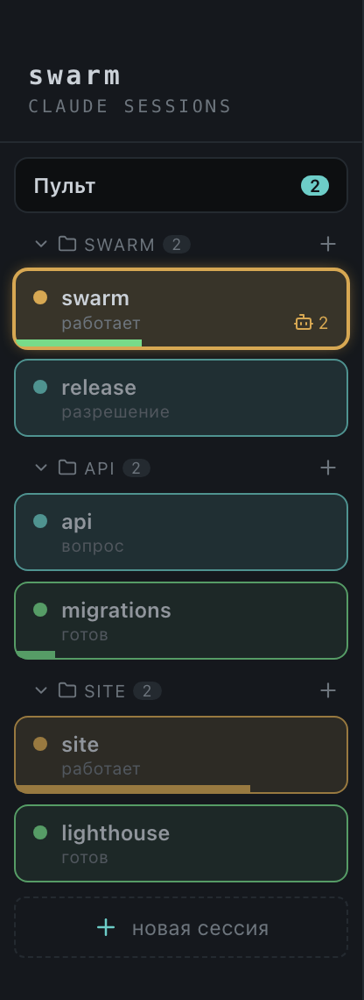</p>

> [!TIP]
> Заводите агентов в папках проектов, а не в домашней: иначе macOS засыплет вас запросами
> доступа к файлам — по одному на каждую папку, куда агент заглянет.

## Пока он работает

Вкладка красится сама:

| Цвет вкладки | Что происходит |
|---|---|
| **Оранжевая** | работает: печатает, думает, гоняет инструмент |
| **Бирюзовая** | ждёт вашего ответа — вопрос или запрос разрешения |
| **Зелёная** | закончил |
| **Серая** | вкладка закрыта |

Цвет не угадывается по картинке в терминале — его сообщает сам Клод, поэтому он не врёт и не отстаёт. Рядом с цветом карточка показывает, сколько агент уже ждёт, сколько у него работает подагентов и насколько заполнен контекст.

<p align="center">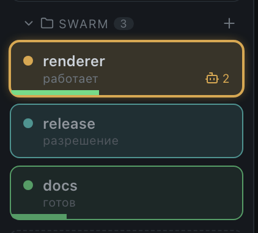</p>

Полоска контекста отвечает на вопрос «кого пора сжимать». Полную картину показывает команда `/usage` в Telegram: все вкладки, самые полные сверху, плюс окна подписки на 5 часов и на неделю со временем сброса. Расход самой подписки виден и без телефона — в нижней панели, справа: оба окна, 5 часов и неделя, и время обновления лимитов, когда запас поджал.

Когда вкладка в фоне позеленела или стала бирюзовой, прилетает системное уведомление — клик открывает нужную. В настройках можно оставить только одно из двух событий, добавить звук или выключить совсем.

<!-- ФОТО 4 · docs/img/04-notification.png · системное уведомление macOS от Swarm поверх окна. -->

## Когда ждут несколько

Вкладка **Пульт** держит очередь всех, кто ждёт ответа, с таймером у каждого. Отвечать можно прямо оттуда, в терминал выбранного, и после ответа очередь сама переходит к следующему.

Счётчик ожидающих стоит на самой вкладке Пульта, так что заходить внутрь, чтобы узнать, нужны ли вы кому-то, не приходится.

<p align="center">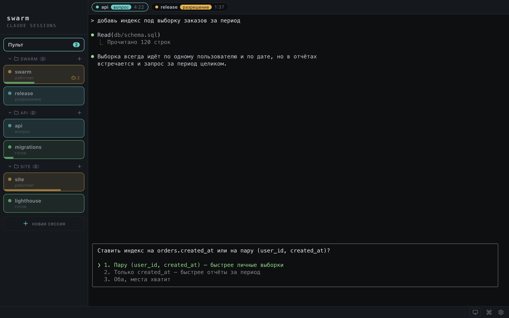</p>

## Что под рукой, пока вы правите код

**Команды проекта.** Кнопка **☰ команды** открывает список: встроенные команды по группам плюс найденные в проекте (`.claude/commands`, `.claude/skills`) и ваши глобальные. Выбрать из списка быстрее, чем вспоминать точное имя.

<p align="center">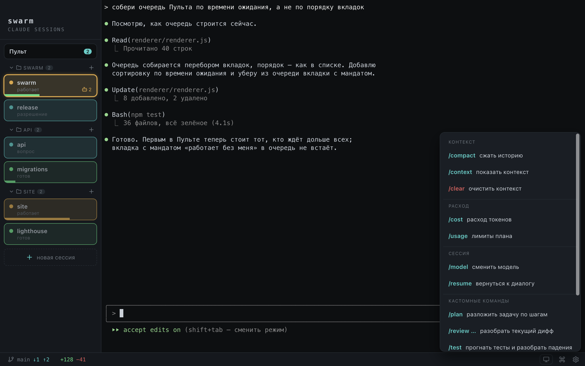</p>

**Ветка и правки.** Внизу окна показана ветка папки активной вкладки и что с ней происходит:

| | |
|---|---|
| `+N −M` | сколько строк добавлено и удалено, но не закоммичено |
| `↓N` | на сервере N новых коммитов |
| `↑N` | у вас N неотправленных |

<p align="center">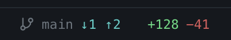</p>

Клик по счётчику изменений показывает дифф — деревом файлов и подсветкой правок, с выходом в ваш редактор.

<p align="center">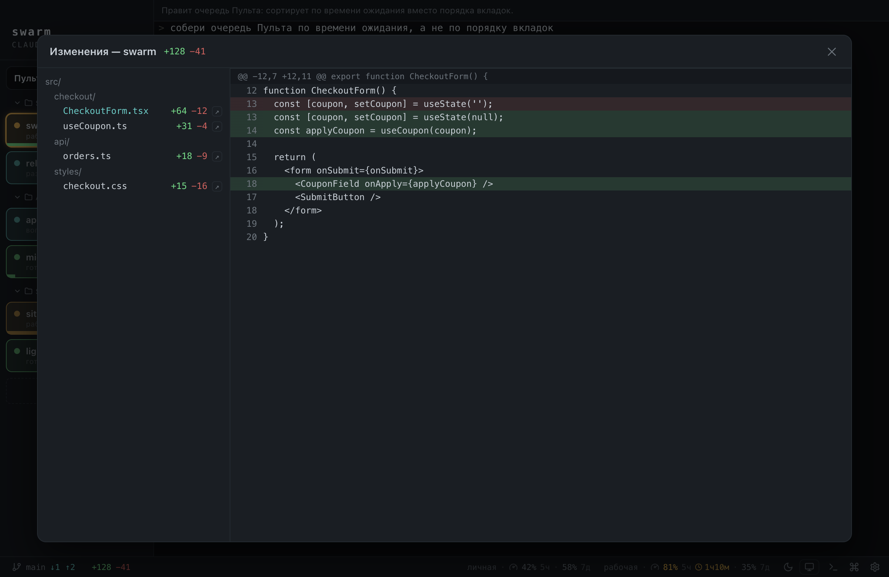</p>

Клик по имени ветки открывает меню: свериться с сервером, подтянуть новое и список веток по свежести — клик переключает. Смотреть и переключать ветки можно всегда; чтобы сходить на сервер, нужно быть залогиненным в git, и если нет, приложение объяснит, как войти.

## Когда вас нет: ночной режим

Вы отдали вкладке задачу и ушли — за кофе, спать, в другой проект. Беда всегда одна: агент останавливается на первом же вопросе и стоит до вашего возвращения, даже если спрашивал про имя переменной. Три отданные вкладки — три потерянных вечера.

Поэтому у вкладки есть **ночной режим**: работай без меня. Состояние одно — «эта вкладка отдана», — а дверей к нему две: одна отдаёт вкладку, другая все сразу.

**Одной вкладке.** Наведите на её карточку и нажмите полумесяц. Карточка целиком станет фиолетовой, так что видно, какие вкладки уже не ваши; палитра статусов на ней больше не работает — что с агентом, остаётся подписью словами. Так и живёт обычный день: одной вкладке отдали задачу на вечер, в остальных сидите сами.

<p align="center">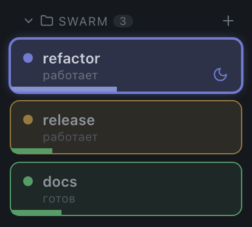</p>

**Всем сразу.** В нижней панели стоит **луна**; клик открывает два пункта — «отдать все вкладки» и «забрать все себе» (второй спрашивает подтверждение). Когда отданы все, вся нижняя панель становится синей: это видно от двери, и нужно это прежде всего при возвращении, когда вкладки всё ещё решают за вас.

<p align="center"></p>

Состояние тут одно — «эта вкладка отдана», — а общее положение по вкладкам и считается. Включили общее: полумесяц загорается на всех карточках, будто вы протыкали их руками. Забрали хоть одну — общее снимается само, остальные продолжают работать без вас. Отдали руками последнюю оставшуюся — общее включается само. Новая вкладка, открытая ночью, рождается отданной. Сколько вкладок отдано прямо сейчас, показывает счётчик в панели, и клик по нему (с подтверждением) забирает все назад. Пока без вас работает хоть одна вкладка, мак не уснёт.

<p align="center">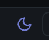</p>

### Что происходит с отданной вкладкой

Агент, который собрался спросить вас с вариантами «1 / 2 / 3», получает отказ и вместе с ним правило: человека нет; если решение обратимо или переделка дешёвая — выбери сам и продолжай, а если ответ задаёт направление и ошибка стоит дорого — сформулируй вопрос текстом и остановись. Отказ приходит внутри хода, поэтому агент даже не встаёт: прочитал и пошёл дальше.

Если вопрос всё-таки задан текстом и вкладка встала, Swarm один раз печатает в неё то же правило. Один раз — и это важно: агент, который его услышал, помнит правило до конца работы. Вкладка, вставшая уже после правила, ждёт вас по-настоящему, и спорить с ней больше никто не будет.

Ещё две вещи Swarm делает за вас, потому что иначе они стоят часов простоя. Вкладку, упёршуюся в лимит подписки, он будит сам — время сброса ему сообщает Клод, — а если Клод дождался сброса и просит нажать клавишу, нажимает за вас. А вкладку, которая поработала и замолчала на пороге следующего этапа («закончил груминг, скажи, когда приступать»), он спрашивает сам: работа кончилась или впереди следующий этап? Так продолжить вкладка может не больше трёх раз, дальше ждёт вас.

**Разрешения.** Дешёвое мандат берёт на себя, дорогое оставляет вам. Сам он разрешает посмотреть в гит (`status`, `diff`, `log`, `show`), добавить файлы по именам и зафиксировать их — заранее, до того как диалог успеет появиться, так что вкладка не встаёт вовсе. Иначе ночь кончалась на первом промежуточном коммите. Всё остальное ждёт вас: `push`, `tag`, `reset`, `add -A`, команда с цепочкой или подстановкой, любая не-гитовая команда. И релизов ночной режим не делает ни в каком случае.

**Отработала — позеленела.** Отданная карточка фиолетовая, пока вкладка не ваша, и по цвету не видно, работает она ещё или уже всё. Кончив задачу, агент говорит это сам и пишет итог — карточка зеленеет, оставаясь отданной. Вернувшись, вы видите, что читать.

### В отданную вкладку не печатают

Первая клавиша агенту не уедет: Swarm спросит, забрать ли вкладку себе, и набранное уйдёт только после «Забрать себе».

<p align="center">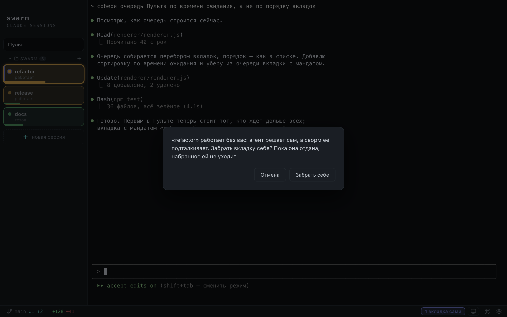</p>

Это не строгость ради строгости. В отданную вкладку печатает сам Swarm — правилом, вопросом про этап, будильником по лимиту, — а два писателя в одну строку ввода дают мусор вместо просьбы. Да и человек, который печатает в отданную вкладку, чаще всего просто забыл, что отдал её. Кнопка снимает отметку с этой вкладки — и только с неё; остальные вкладки продолжают сами.

### Что было без вас

Рассказывает об этом сама вкладка. Агент, работающий без человека, узнаёт в начале задачи, что закончить её надо итогом: что сделано, что он решил сам вместо вас и почему, что осталось и чем это проверять.

Итог — обычное последнее сообщение хода. Вы читаете его, открыв вкладку; карточка вкладки до этого мига помечена как непрочитанная, а если вы были с телефоном, тот же итог уже пришёл в её тему в телеграме.

Сводки, которую Swarm собирал сам, больше нет, и это осознанно. Собирать её приходилось из следов — из запрещённых развилок, простоев, времени конца хода, — потому что приложение видит, ЧТО происходило на экране, и не видит, ЧТО сделано. Выходил честный пересказ поведения вкладки вместо результата. Результат знает один агент — он теперь и рассказывает.

**Свои слова.** Правило и вопрос замолчавшей вкладке можно переписать под свой уклад — «Настройки → Ночной режим». Пустое поле означает заготовку Swarm, она же стоит в поле серым, так что её удобно скопировать и поправить: кому-то нельзя касаться миграций, кому-то можно всё, кроме сети.

<p align="center">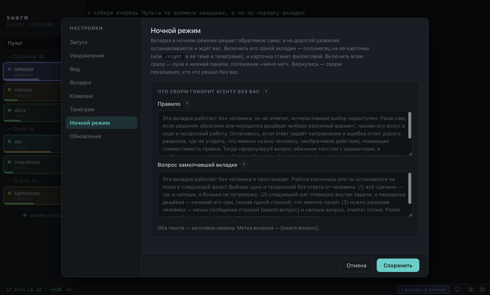</p>

С телефона доступно то же самое, и командой одной и той же: `/night` в теме вкладки включает ночной режим ей, в общей теме — всем вкладкам сразу, вторым разом снимает.

## Telegram: ответить с телефона

Когда вы ушли, агенты продолжают работать — и продолжают упираться в вопросы, которые за вас не решить. Мост даёт им тему в группе на каждую вкладку. Список тем в телефоне — это список ваших агентов, и по каждому видно, работает он, ждёт вас или закончил.

<!-- ФОТО 12 · docs/img/12-tg-topics.png · телефон: список тем группы, по теме на вкладку. -->

### Настройка, один раз

Три шага в «Настройки → Телеграм», у каждого своя галочка готовности:

1. **Бот.** Напишите `@BotFather` команду `/newbot` и вставьте полученный токен в первый шаг.
2. **Группа.** Создайте группу, включите в ней «Темы», нажмите «Привязать группу» и отсканируйте QR.
3. **Админство.** Сделайте бота администратором.

Под вторым шагом висит живой список требований — темы, бот в группе, админство, права. Каждый пункт с галочкой или крестиком, так что видно все беды сразу, а не по одной за нажатие. Поправьте в Telegram и нажмите «Проверить ещё раз».

<p align="center">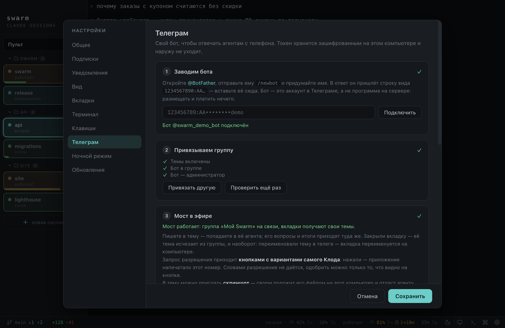</p>

> [!IMPORTANT]
> Нужна именно группа с включёнными темами: вкладок много, и различать их на телефоне
> можно только темами. Личный чат приложение привязывать откажется.

### Что можно из чата

**Написать агенту.** Зайдите в тему нужной вкладки и просто напишите — текст уйдёт в живую сессию, как будто вы набрали его на клавиатуре. Ни реплаев, ни команд не нужно: тема и есть адрес. Ответ придёт туда же, целиком и с нормальной разметкой.

<!-- ФОТО 14 · docs/img/14-tg-chat.png · телефон: диалог в теме вкладки — задача текстом и ответ агента. -->

**Дать разрешение.** Запрос приходит кнопками: в сообщении видно команду, которую вы одобряете, и пронумерованные варианты. Достаточно нажать номер.

<!-- ФОТО 15 · docs/img/15-tg-permission.png · телефон: запрос разрешения с командой, вариантами и кнопками. -->

**Сказать голосом.** Запишите голосовое в тему — Swarm распознает его на вашем компьютере и пришлёт эхо услышанного, чтобы вы поймали ошибку до того, как агент начнёт по ней работать. Включается одной кнопкой в настройках, распознаватель скачается сам.

<!-- ФОТО 16 · docs/img/16-tg-voice.png · телефон: голосовое и ответное эхо «🎙 услышал: …». -->

**Показать картинку.** Пришлите скриншот в тему, и агент посмотрит его сам, а подпись к картинке станет задачей. Это быстрее, чем пересказывать пальцами красную простыню из терминала.

**Навести порядок.** Если вы переименуете вкладку на компьютере, переименуется и тема — и наоборот, из телефона тоже. Тема заводится вместе со вкладкой и исчезает вместе с ней.

### Команды бота

| Команда | Что делает |
|---|---|
| `/tabs` | вкладки и их состояние; имя вкладки — ссылка в её тему |
| `/last` | что агент сказал последним, даже если он ещё работает |
| `/phone` `/comp` | где вы сейчас: писать обо всём — или молчать |
| `/night` | ночной режим: в теме вкладки — ей одной, в общей теме — всем сразу |
| `/mode` | режим разрешений вкладки |
| `/usage` | контекст по вкладкам и окна подписки |
| `/new` | ещё один агент в папке этой темы |
| `/sync` | привести темы в соответствие с вкладками |
| `/help` | напоминалка по командам |

<!-- ФОТО 17 · docs/img/17-tg-tabs.png · телефон: ответ на /tabs со списком вкладок и их состоянием. -->

Любая другая команда со слэшем уходит агенту: `/clear`, `/compact`, `/model` и ваши собственные из `~/.claude/commands` работают с телефона так же, как с клавиатуры. Аргументы едут вместе с командой.

### За компом или за телефоном

Это два положения значка «где я» в нижней панели. Ночного режима там нет — он про вкладки, а не про вас, и живёт своей луной рядом. От выбранного положения зависит, будет мост писать вам или молчать:

| | За компом | За телефоном |
|---|---|---|
| **Мост пишет сам** | ничего | вопросы, разрешения, итоги ходов |
| **Писать агенту из чата** | нельзя | можно |
| **Сон компьютера** | как обычно | не засыпает |

Смотреть можно всегда: `/tabs`, `/last` и `/usage` работают в любом положении.

Уходя, переключите на телефон — иначе мост промолчит, а компьютер уснёт посреди хода. Если забыли, скажите боту `/phone`: он сделает то же самое и досошлёт всё, что вы пропустили. Вернувшись, переключите обратно: пока выбран телефон, нижняя панель подкрашена янтарным, чтобы это было видно сразу.

<p align="center">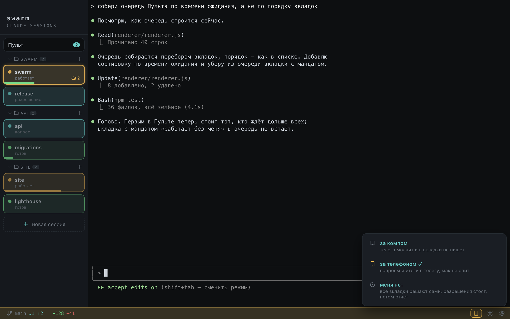</p>

Пока вы в телеге, агент отвечает по-телефонному: без стен кода и без интерактивного выбора вариантов, который с телефона нечем нажать. Насколько подробно он отвечает, задаётся настройкой: «Кратко» или «Полностью».

## Настроить под себя

Всё настраивается переключателями в самом приложении, кнопкой **⚙ настройки**. Ни файлы править, ни команды набирать не придётся.

### Подписки

<!-- ФОТО · docs/img/25-settings-subs.png — «Настройки → Подписки»: карточки с именами и галкой про панель -->

**Одна карточка на подписку.** В ней строка запуска (обычно `claude`, но это просто команда с флагами: `claude-my --model sonnet`, `claude-glm`, ваш алиас), имя — «личная», «рабочая» — и галка «показывать остатки в нижней панели». Этот же список решает, чем открывать вкладки: карточек несколько — приложение спросит при открытии, и в вопросе будут имена, а не две почти одинаковые команды. Ниже — вид панели: какое окно показывать и когда показывать время сброса.

Строка, у которой лимитов не бывает (`codex`, другой агент), остаётся такой же карточкой — вместо чисел на ней написано, что остатков пока не видели.

### Общее

<p align="center">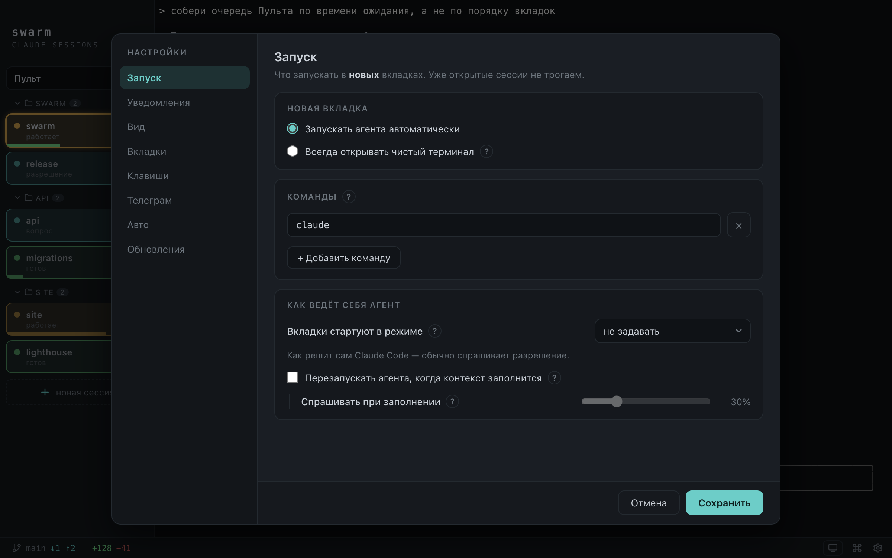</p>

**Режим разрешений.** С каким режимом стартуют вкладки: manual, edits, plan, auto. Дальше он переключается как обычно. Здесь же — открывать ли вкладку агентом сразу или чистым терминалом и спрашивать ли при открытии, когда подписок несколько.

**Перезапуск по контексту.** Вкладка, у которой контекст почти кончился, может начать свежую сессию сама — с просьбой к агенту передать дела. Порог задаётся ползунком, а агент может позвать перезапуск и раньше, если знает, что впереди большая работа.

**Чтобы вкладка отличала вопрос от завершения.** Клод заканчивает ход одинаково и когда сделал дело, и когда спросил, — и это единственное, чего не знает ни один канал статуса. Настраивать тут нечего: Swarm сам просит агента помечать вопрос отдельной строкой, флагом в команде вкладки, и ваши файлы для этого не меняются.

**Строка статуса.** Swarm дописывает в неё полоску контекста — из неё живут карточка вкладки, `/usage` и перезапуск по контексту. Ваша собственная строка при этом никуда не девается: она печатается следом, в той же строке. Настраивать нечего.

**Что включено всегда.** Хуки Клода, своя строка статуса и возврат в тот же разговор после перезапуска приложения переключателей не имеют: все три были галками, выключенными по умолчанию, то есть из коробки человек жил на худшем варианте и не знал об этом.

### Вид и вкладки

Тема и шрифт терминала, плотность карточек, что на них показывать, цвета статусов — всё с предпросмотром прямо в панели.

<p align="center">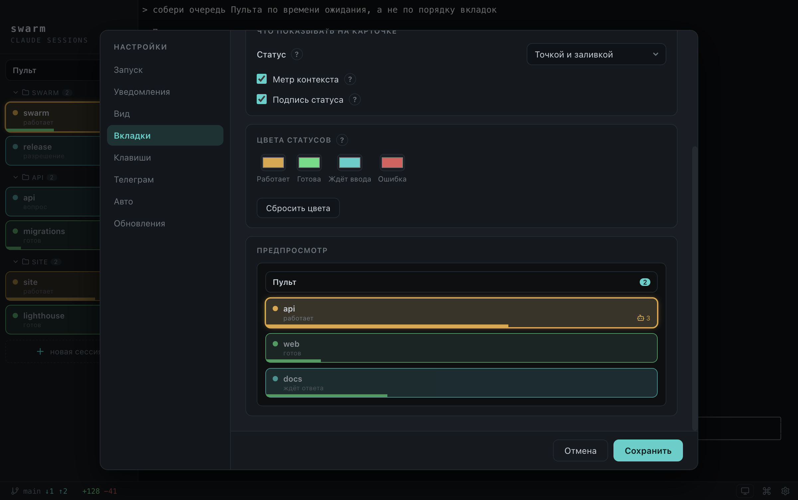</p>

Там же выбирается раскладка: список вкладок бывает рейлом слева или плашками-дашбордом сверху.

<p align="center">
  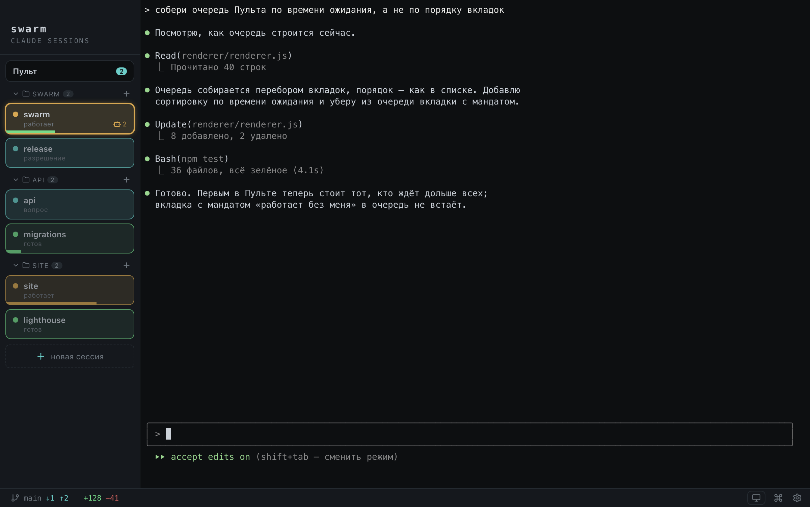
  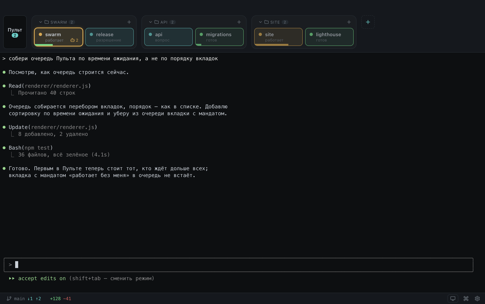
</p>

### Авто и Телеграм

Страница **«Ночной режим»** отвечает за работу без вас: там переписываются правило и вопрос замолчавшей вкладке (см. [«Свои слова»](#когда-вас-нет-ночной-режим)). Страница **«Телеграм»** — мастер моста из трёх шагов и кнопка, которой ставится распознавание голоса.

> Аккаунт и модель живут в вашем шелле, а не в приложении. Нужен конкретный аккаунт или свой
> `ANTHROPIC_BASE_URL` — пропишите `export` в `~/.zshrc`, и каждая новая вкладка его подхватит.

## Горячие клавиши

Всё это можно сделать и кнопками, клавиши просто быстрее. На Windows вместо <kbd>⌘</kbd> — <kbd>Ctrl</kbd>.

| | |
|---|---|
| <kbd>⌘T</kbd> | новый агент в папке по умолчанию |
| <kbd>⌘O</kbd> | новый агент с выбором папки |
| <kbd>⌘W</kbd> | закрыть текущего агента |
| <kbd>⌘1</kbd> … <kbd>⌘9</kbd> | переключиться на вкладку |
| <kbd>⌘0</kbd> | Пульт |
| <kbd>⌘L</kbd> | сменить раскладку |
| <kbd>⌘K</kbd> | команды |
| <kbd>⌘,</kbd> | настройки |
| <kbd>⌘/</kbd> | справка внутри приложения |

<sub>Отдельная вкладка настроек «Клавиши» задаёт модификатор для перемещения и удаления по словам и до края строки, и хоткей переноса строки.</sub>

## Другие агенты, кроме Клода

Команда вкладки задаётся вами, так что запустить можно любой консольный агент или просто шелл. Вкладки, терминалы, группировка по папкам, git-бар и отправка текста из Telegram работают с чем угодно.

А вот статусы, уведомления, Пульт, кнопки разрешений, работа без вас и `/usage` работают только с Claude Code: они читают именно его. С другим агентом приложение само их не применяет — чинить ничего не нужно.

<sub>Обёртка вокруг Клода чужим агентом не считается: свой алиас, другая модель или свой бэкенд через `ANTHROPIC_BASE_URL` — это тот же Claude Code, и работает всё.</sub>

## Что уходит наружу

Ничего, кроме того, что и так ушло бы.

- Аккаунта у Swarm нет, регистрации нет, телеметрии нет. Приложение запускает `claude` и работает на вашей подписке; токены Клода не читает и не хранит.
- Бот в Telegram — ваш собственный. Сервер не нужен: приложение опрашивает Telegram само, наружу не открывается ни порт, ни адрес. Обратная сторона — если Telegram у вас работает только через VPN, то и мост тоже.
- Бот слушает ровно один чат, сообщения из любого другого игнорирует. Токен лежит в файле настроек, доступном только вашей учётной записи.
- Голос распознаётся на вашем компьютере. Звук никуда не отправляется.

## Если что-то не так

<details>
<summary><code>claude: command not found</code> во вкладке</summary>

<br>

Claude Code не виден login-шеллу. Swarm запускает ровно эту команду, так что сначала проверьте `claude --version` в обычном терминале и поправьте `~/.zshrc`.

</details>

<details>
<summary>Приложение не открывается после установки</summary>

<br>

Снимите карантин — см. предупреждение в [«Установке»](#установка):

```bash
xattr -dr com.apple.quarantine /Applications/Swarm.app
```

</details>

<details>
<summary>macOS сыплет запросами доступа к файлам</summary>

<br>

Заводите агентов в папках проектов, а не в домашней.

</details>

<details>
<summary>Вкладка не отличает «ждёт ответа» от «готов»</summary>

<br>

Значит агент не помечает вопрос отдельной строкой. Swarm просит об этом сам, но отступает в двух случаях: вы передали вкладке свой `--append-system-prompt` (ваш текст главнее) или запускаете не Клода, а лончер, в имени которого его не видно. Тогда объясните тег агенту сами — строкой в `CLAUDE.md`, [как это устроено](MANUAL.md#пока-агент-работает).

</details>

<details>
<summary>Ложный «готов» на долгой паузе</summary>

<br>

Приложение специально давит такие ложняки, но при очень тихих операциях статус может дёрнуться — ориентируйтесь по самому терминалу вкладки.

</details>

<details>
<summary>В отданную вкладку не печатается</summary>

<br>

Так и задумано: вкладка, которой вы отдали задачу, вам не принадлежит, пока вы её не забрали. Нажмите «Забрать себе» в вопросе, который появился на первой клавише, — набранное уйдёт агенту целиком. Полумесяц на карточке снимает ночной режим заранее.

</details>

<details>
<summary>Вкладки решают сами, хотя я за компьютером</summary>

<br>

Значит вкладка отдана — или она одна, или отданы все. В панели про это висит луна с числом, клик открывает «забрать все себе». Отдельную вкладку возвращает полумесяц на её карточке, остальные при этом продолжают сами.

</details>

<details>
<summary>В строке статуса появился кусок от Swarm</summary>

<br>

Так и задумано: Swarm дописывает слева полоску контекста — на ней держатся карточка вкладки, `/usage` и перезапуск по контексту. Ваша собственная строка идёт следом в той же строке, целиком, — Swarm зовёт вашу команду и печатает её вывод рядом со своим. Расхода подписки в этой строке больше нет: окна лимитов не про вкладку, а про аккаунт, и они переехали в нижнюю панель приложения.

Если ваша строка не появилась, смотрите, не молчит ли она сама: на ответ ей даётся секунда, после чего Swarm печатает только своё, чтобы не задерживать отрисовку.

Вне Swarm ваша строка не меняется никогда.

</details>

<details>
<summary>Бота выгнали из группы или разжаловали</summary>

<br>

Swarm узнает об этом сразу и скажет в панели настроек, а не будет молча показывать «мост в эфире».

</details>

---

<p align="center">
  <sub>
    <a href="MANUAL.md">Руководство</a> &nbsp;·&nbsp;
    <a href="WINDOWS.md">Windows</a> &nbsp;·&nbsp;
    <a href="CHANGELOG.md">История версий</a> &nbsp;·&nbsp;
    <a href="DEVELOPMENT.md">Разработка</a> &nbsp;·&nbsp;
    <a href="LICENSE">MIT</a>
  </sub>
</p>
